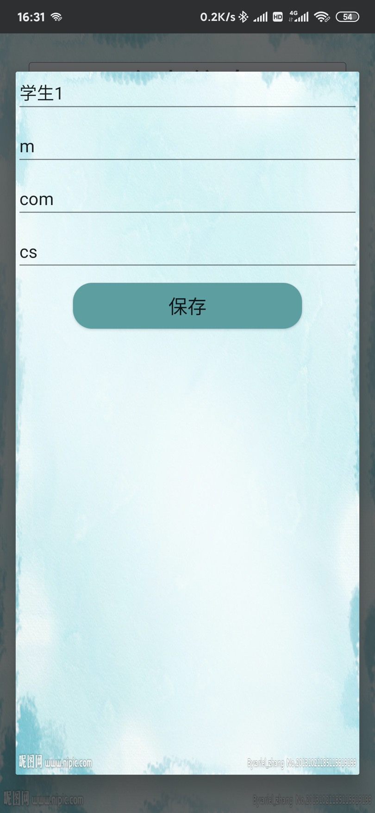

# Android:网络版学生系统

## 项目简介

网络版学生信息管理APP，android客户端实现：

1. 学生、管理员登录。
2. 学生自我信息修改。
3. 管理员对所有信息管理。
4. 交换数据通过服务器，数据储存在服务器数据库中。

## 项目设计

### 使用工具

##### 1.服务器搭建

技术：
* javaweb 
* tomcat
* mysql8

工具：
* idea

##### 2.客户端开发

技术：

* android（sdk 29)

工具：

* android studio (ver. 3.5.1)

* java(ver.1.8.0)

* gradle(ver. 5.4.1)

### 数据库设计

### 用户交互界面设计

##  项目部署方法

##### 服务器：IntelliJ IDEA（或其他编译工具）

1. Sql 导入数据库中
2. 将服务器项目导入到 IntelliJ IDEA 中。
3. 创建 Tomcat 实例。
4. 修改项目中 */TestJee/src/com/cqjtu/SQLHelper/SQLhelper.java 的数据库连接名及用户验证。
5. 启动 Tomcat 实例。

##### 客户端：Android Studio（或其他编译工具）

1. 将客户端项目导入到 Android Studio 中。

2. 电脑连接手机的热点。

3. 查看此时电脑的ip地址。

4. 修改项目中 */StudentSystem/app/src/main/java/com/cqjtu/studentsystem/HttpUtils.java 的BASE_URL

   > 格式为：http://ip地址:端口号(默认8080)/服务器端 Tomcat 实例名/

5. 部署客户端到手机上，或者直接启动内置模拟器。

## 项目演示

数据库数据：

启动服务器端：

显示如下即为正常：

打开手机客户端：

*主页 && 管理员界面* 

*学生增加 && 管理员注册* 

*学生界面 &&学生信息修改* 

